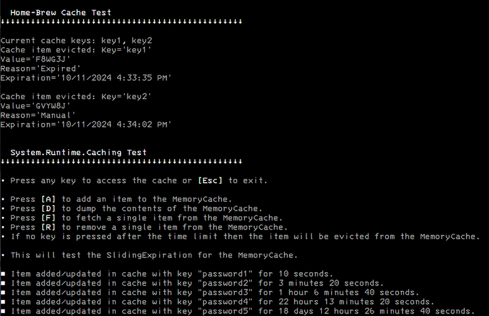

 
# EasyCache


## v2.0.0.0 - October 2024
**Dependencies**

| Assembly | Version |
| ---- | ---- |
| NET Core | 6.0 (LTS) |
| NET Framework | 4.8.1 |
| System.Runtime.Caching | 8.0.0.1 |

- A [memory caching](https://learn.microsoft.com/en-us/dotnet/api/system.runtime.caching.memorycache?view=net-6.0) library which offers timed evictions for stored objects.
- I've also created my own version of Microsoft's memory cache to show how you could roll your own.

- This solution includes a console application for testing the DLL.

## Usage

```csharp

 // Instantiate
 var cache = new CacheHelper<string>();

 // Add an item
 cache.AddOrUpdate("key1", "value1", TimeSpan.FromSeconds(3));
 // Add an item to update
 cache.AddOrUpdate("key3", "value3", DateTime.Now.AddMinutes(1));
 // Update an item
 cache.AddOrUpdate("key3", "updated value3", DateTime.Now.AddMinutes(2));

 // Check expiry
 var dt = cache.GetExpiration("key3");
 Console.WriteLine($"key3 will expire at {dt.Value.ToLongTimeString()}");

 // Check if exists
 Console.WriteLine($"The current cache does {(cache.Contains("key1") ? "" : "not")} contain key1");

 // Refresh the expiration by fetching
 var temp = cache.Get("key1");

 // Delete an item
 cache.Remove("key1");

 // Check if exists after removal
 Console.WriteLine($"The current cache does {(cache.Contains("key1") ? "" : "not")} contain key1");

 // Fetching all keys
 var keys = cache.GetAllKeys();
 foreach (var key in keys) { /* do something */ }

 // Fetching all objects
 var objs = cache.GetCacheAsEnumerable();
 foreach (var obj in objs) { /* do something */ }

 // Clean-up
 cache.Dispose();

```

## Example


